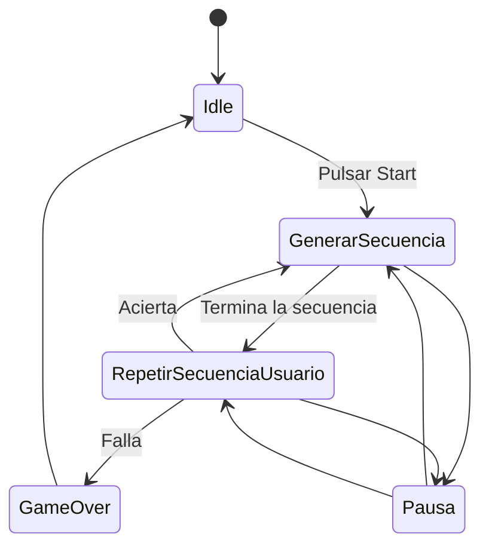

# Diagrama de Estados del Juego "Simón Dice"

## Persistencia de Datos en rama featurePersistencia
## Vídeo Demostrativo

# Explicación del programa

## Flujo del juego

1. El usuario pulsa **START**.
2. Se genera un color y se añade a la secuencia.
3. Se reproduce la secuencia.
4. Es el turno del jugador para introducir la secuencia.
5. Si acierta → nueva ronda, se añade un color y se repite el proceso.
6. Si falla → aparece el **Game Over** y se puede reinicia

---
## Datos.kt

Contiene la *data class* `Datos`, que sirve para almacenar la información del juego, como:

- La ronda actual.
- La secuencia generada.
- El récord.

También incluye el **enum `Estados`**, que define los estados lógicos del juego:  
`Inicio`, `GenerarSecuencia`, `IntroducirSecuencia`, `GameOver`.

Además contiene el **enum `Colores`**, que define los colores utilizados en el juego con su valor RGB y su nombre.

---

## MyViewModel.kt

Contiene la clase `MyViewModel`, que extiende de `ViewModel` y maneja toda la **lógica del juego**. Sus funciones son:

- **empezarJuego()**  
  Reinicia todos los valores, genera el primer color y reproduce la secuencia.

- **generarColor()**  
  Añade un número aleatorio entre 0 y 3 a la secuencia (cada número representa un color). Cambia el estado a `GenerarSecuencia`.

- **reproducirSecuencia()**  
  Recorre la secuencia, espera un segundo entre colores y, en esta versión, la reproduce mediante logs. Al terminar, cambia el estado a `IntroducirSecuencia`.

- **introducirColor(color: Int)**  
  Compara lo que introduce el jugador con la secuencia generada:
    - Si no coincide → llama a `gameOver()`.
    - Si coincide → suma una ronda, genera un nuevo color y reproduce la secuencia de nuevo.

- **gameOver()**  
  Comprueba si la ronda actual supera el récord y lo actualiza si es necesario. Cambia el estado a `GameOver`.

- **resetToInicio()**  
  Vuelve al estado `Inicio` y reinicia las secuencias y la ronda.

---

## Tests (unitarios / instrumented)

Descripción breve de tests incluidos:

- `testEmpezarJuego`  
  Verifica que `empezarJuego()` inicializa `ronda` a 1, crea la primera entrada en `secuencia` y cambia el estado a `GenerarSecuencia`.

- `testGenerarSecuencia`  
  Comprueba que tras avanzar la reproducción y simular entradas correctas la secuencia aumenta correctamente.

- `testAciertoSecuencia`  
  Verifica que introducir el color correcto durante `IntroducirSecuencia` es aceptado y no provoca `GameOver`.

- `testFalloSecuencia`  
  Simula una pulsación incorrecta y comprueba que `estadoActual` pasa a `GameOver`.

- `testRecord`  
  Simula varias rondas con aciertos, fuerza un fallo y comprueba que `record` se actualiza.

